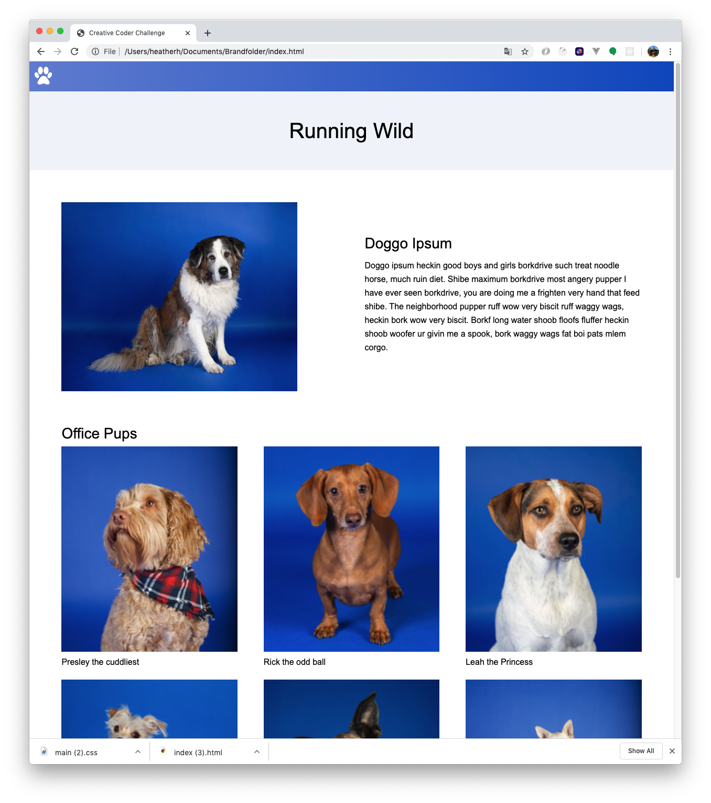
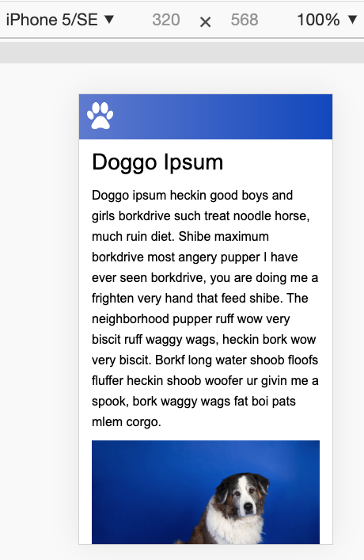
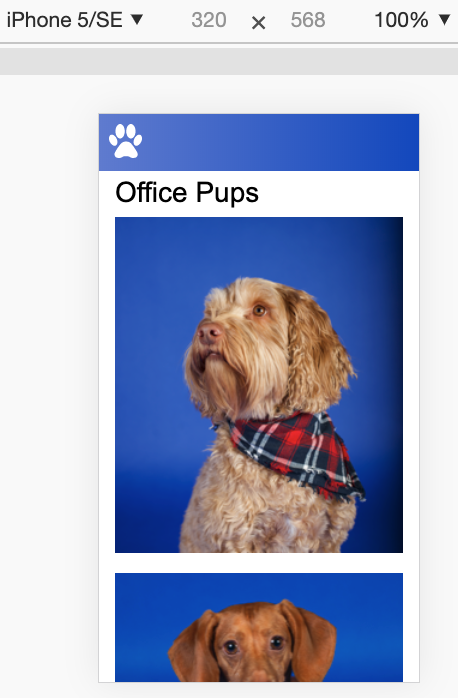

# Office Dog Party
Goal: to create a responsive "Office Dog Party"-themed layout across desktop and mobile views based on the Challenge Instructions and mockup(dog-comp.png)

*Desktop Screenshot:*

*Mobile Screenshots:*  
  

**Recently Added:**
- Semantic HTML
- Custom font (font-family: "Arial", "Trebuchet MS", sans-serif;)
- Gradient-background nav
- Sticky nav
- More grid styling
- Media query to remove "office-pup-text" as well as display "top-dog-text" above "top-dog-image" on mobile and tablet devices (768px and below)
- Allow images to stack on mobile and tablet devices
- Hover effect on office pup images (opacity 0.75)

